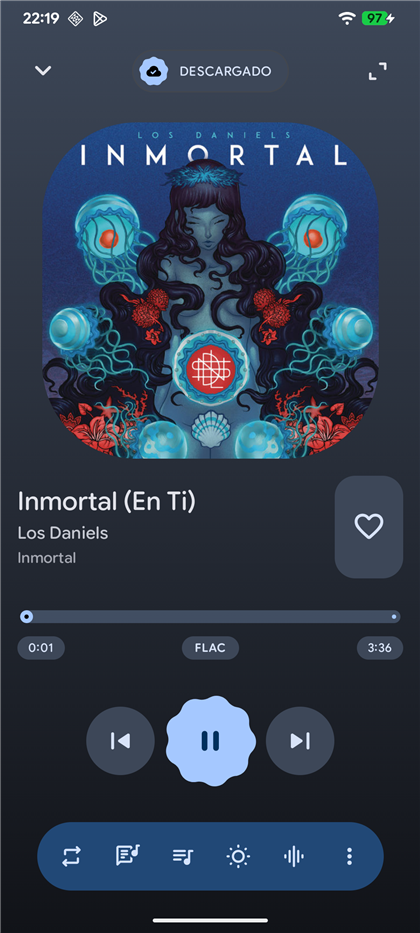
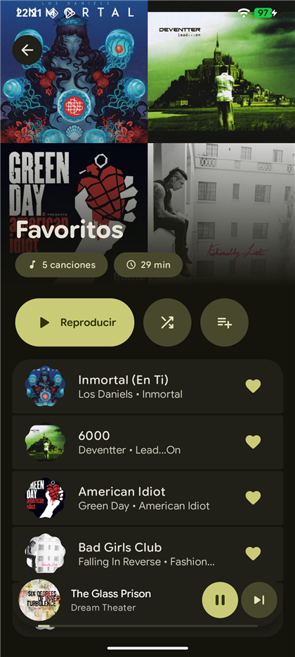
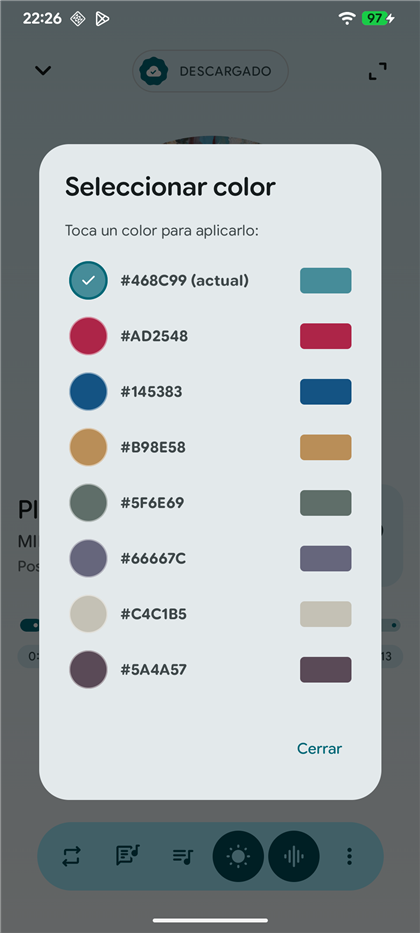
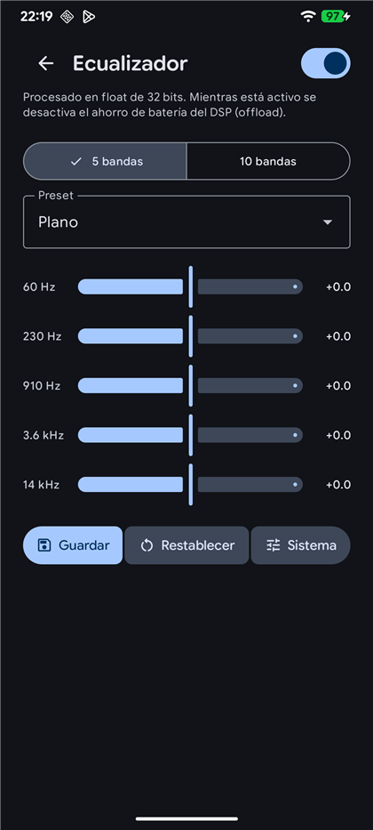
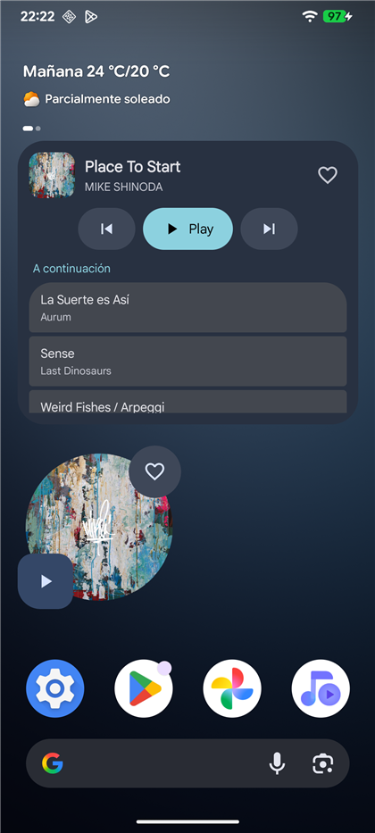
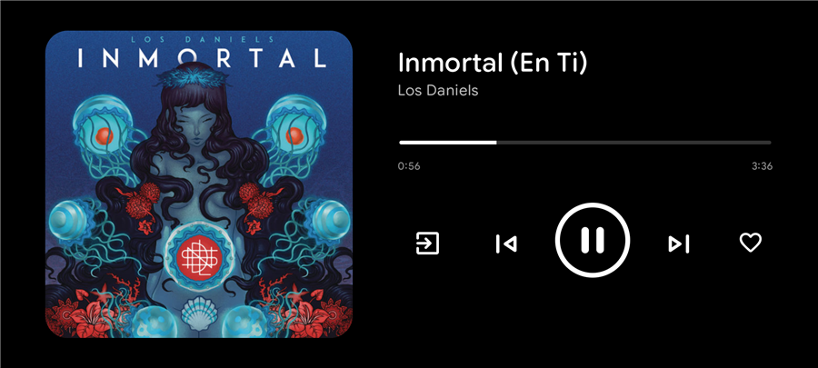

<div align="center"> 


<h1 align="center" > <b> Siku Music </b></h1>
</div>

<p align="center">A music player <b>VIBE CODED</b> for android entirely with <b>Material 3 Expressive</b></p>

[](LICENSE)


<p align="center">
  
  
  
</p>
<p align="center">
  
  
</p>
<p align="center">
  
</p>

## Why

I wanted a music player to sync my music mainly from my Onedrive cloud and that's all. Siku started as sync and download with some features useful for me (and I hope for you too) and then I just transformed into a full local music player that syncs with Onedrive (if you need more providers, tell me). I'm not a power user and in fact I don't use a lot of the things I've added (don't worry I've tested the majority of them) but if you see that there's a missing feature, again tell me and I see what I can do

## Features

**Sources**
- **OneDrive** via Microsoft Graph, with incremental *delta* sync — after the first scan it
  only fetches what changed
- **Local folders** through the Storage Access Framework
- Merge both, with cross-source duplicate detection (tell me if the duplication mechanism works well)
- Stream directly, or wait until download all your library. Checks if you are on Wifi or mobile data so you can select how to listen
- Adaptive parallel downloads, you can pause or stop the downloads or retry them if it fails

**Audio**
- FLAC, MP3, M4A, OGG, WAV, and anything else that ExoPlayer handles
- **ReplayGain** read straight from FLAC Vorbis tags (track and album modes, pending deep testing)
- 5 or 10 bands equalizer or you can use the system one.

**Other Features**
- Docked mode
- Sleep timer
- Keep Screen on
- Synced lyrics via LRCLIB. You can choose a result if the automic match fails, you can preview them to check if its correct

**Library**
- Artists, albums, playlists, play history
- Artist photos fetched from Deezer, with a manual picker if the automatic match is wrong
- Playlist backup and restore as JSON in your own OneDrive app folder (If you added it)
- Home with quick actions, and resume playlist, recent songs

**Interface**
- Material 3 Expressive throughout — shape morphing, spring motion, tonal surfaces
- Dynamic theming extracted from album artwork with a manual override per song (if it's the only song) or album
- Home screen widgets (player and queue)
- Spanish and English

## Install

Grab the APK from [Releases](../../releases) and sideload it.

For automatic updates, [Obtainium](https://github.com/ImranR98/Obtainium) tracks GitHub
Releases and updates the app for you.

Requires Android 8.0 (API 26) or newer.

## Privacy

Nothing is collected I'm not interest in your data, and there is no analytics or crash-reporting SDK in
the project — check `app/build.gradle.kts` yourself.

The app talks to **Microsoft Graph** (your files, read-only, plus a
single app-owned folder for playlist backups), **LrcLib** (lyrics), and **Deezer's public API**
(artist photos). Your Microsoft token is stored by MSAL in Android's encrypted storage and
never leaves the device.

## Building

```bash
git clone https://github.com/KevinBorjaDev/siku.git
cd siku
./gradlew assembleDebug
```

**OneDrive login will not work in your build until you register your own Azure app.** The
`redirect_uri` that ships in the repo embeds *my* signing certificate hash, and Microsoft
validates that against the signature of the installed APK. To get it working:

1. Register an app at [portal.azure.com](https://portal.azure.com) → App registrations →
   *Personal Microsoft accounts only*, with `Files.Read`, `User.Read` and
   `Files.ReadWrite.AppFolder`
2. Add an **Android** platform with package name `com.qhana.siku` and your debug signing hash:
   ```bash
   keytool -exportcert -alias androiddebugkey -keystore ~/.android/debug.keystore \
     | openssl sha1 -binary | openssl base64
   ```
3. Put your `client_id` and the resulting `redirect_uri` in
   `app/src/main/res/raw/auth_config_single_account.json`, and your raw hash in the
   `debug { manifestPlaceholders["msalHash"] }` block of `app/build.gradle.kts`

Everything else — local folders, playback, the equalizer, lyrics — works without any of this.

Release builds expect a `keystore.properties` at the project root (`storeFile`,
`storePassword`, `keyAlias`, `keyPassword`). Without it, `assembleRelease` falls back to the
debug key so the build still succeeds, but the resulting APK is not distributable.

## Built with

Kotlin · Jetpack Compose · Material 3 Expressive · Media3/ExoPlayer · Room · Hilt · WorkManager ·
MSAL · Retrofit · Coil · Glance

MVVM over a repository layer, with a `MusicSource` abstraction so OneDrive and local folders
go through the same sync orchestrator.

## Third-party

- [JAudioTagger](https://github.com/Adonai/jaudiotagger) (LGPL-2.1) — ReplayGain tag reading
- [MSAL for Android](https://github.com/AzureAD/microsoft-authentication-library-for-android) (MIT)
- [material-color-utilities](https://github.com/material-foundation/material-color-utilities) (Apache-2.0)
- [MaterialKolor](https://github.com/jordond/MaterialKolor) (MIT)
- Bundled fonts — see [`app/src/main/assets/fonts/NOTICE.md`](app/src/main/assets/fonts/NOTICE.md)

Lyrics come from LrcLib and artist images from Deezer's public API. Neither is affiliated with
this project.

## License

[GNU General Public License v3.0](LICENSE)

If you distribute a modified version, you have to publish your source under the same license.

---

*Siku* is the Andean panpipe. Built by [Qhana](https://github.com/KevinBorjaDev).
